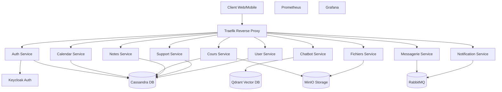
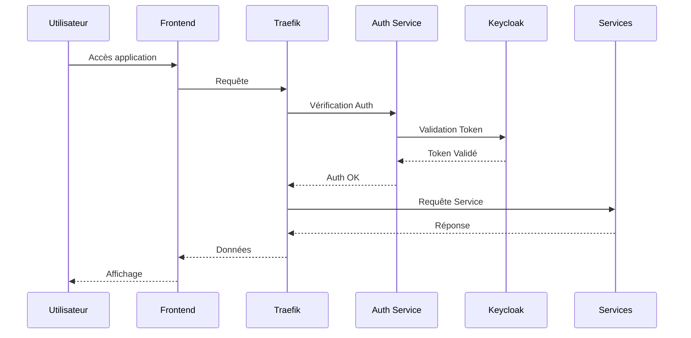
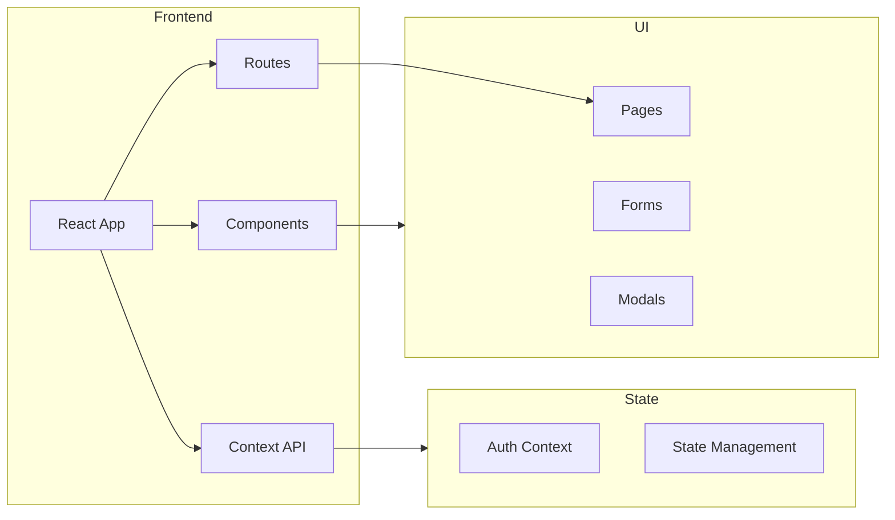

# Plateforme ENT (Environnement Numérique de Travail)

## Description Générale

Cette plateforme est un Environnement Numérique de Travail (ENT) complet conçu avec une architecture microservices. Elle offre une suite d'outils et de services intégrés pour la gestion académique et la communication au sein d'un établissement d'enseignement.

## Architecture Technique

### Vue d'ensemble de l'Architecture



### Flux d'Authentification



### Architecture Frontend



### Technologies Principales

- **Backend** : Python (FastAPI)
  - Framework asynchrone haute performance
  - Documentation OpenAPI automatique
  - Validation des données avec Pydantic
- **Frontend** : React.js
  - Architecture basée sur les composants
  - Gestion d'état avec Context API
  - Routing avec React Router
- **Base de données** :
  - Cassandra
    - Stockage distribué
    - Haute disponibilité
    - Modèle de données optimisé pour les écritures
  - Qdrant
    - Base de données vectorielle
    - Recherche sémantique pour le chatbot
    - Indexation efficace des documents
- **Authentification** : Keycloak
  - SSO (Single Sign-On)
  - Gestion des rôles et permissions
  - Protocoles : OAuth2, OpenID Connect
- **Monitoring** :
  - Prometheus
    - Collecte de métriques
    - Alerting configurable
    - PromQL pour les requêtes
  - Grafana
    - Dashboards personnalisables
    - Visualisation en temps réel
    - Alerting multi-canal

### Microservices

#### 1. Service d'Authentification (`auth-service`)

- Gestion de l'authentification et autorisation
- Intégration avec Keycloak
- Configuration sécurisée des tokens

#### 2. Service de Calendrier (`calendar-service`)

- Gestion des emplois du temps
- Planification des événements
- API REST pour la gestion des calendriers

#### 3. Service de Chatbot (`chatbot-service`)

- Assistant virtuel intelligent
- Indexation automatique des contenus
- Utilisation de Qdrant pour la recherche sémantique
- Scripts d'automatisation pour l'indexation

#### 4. Service de Cours (`service-cours`)

- Gestion des cours et des ressources pédagogiques
- Synchronisation des données
- Intégration avec le stockage de fichiers

#### 5. Service de Fichiers (`service-fichiers`)

- Gestion du stockage de fichiers avec MinIO
- Upload et download sécurisés
- Gestion des permissions d'accès

#### 6. Service de Messagerie (`massagerie-service`)

- Système de messagerie interne
- Notifications par email
- Integration avec RabbitMQ

#### 7. Service de Notes (`notes-service`)

- Gestion des notes et évaluations
- Stockage dans Cassandra
- Métriques de performance

#### 8. Service de Notifications (`notification-service`)

- Notifications en temps réel
- Consommateur RabbitMQ
- Distribution des alertes

#### 9. Service de Support (`support-service`)

- Système de tickets de support
- Suivi des demandes
- Métriques de support

#### 10. Service Utilisateurs (`user-service`)

- Gestion des profils utilisateurs
- Synchronisation des données
- Intégration avec l'authentification

### Frontend (`Frontend/Portail`)

- Interface utilisateur moderne en React
- Composants réutilisables
- Intégration avec Keycloak
- Design responsive
- Fonctionnalités principales :
  - Tableau de bord
  - Calendrier
  - Messagerie
  - Chat
  - Gestion des cours
  - Gestion des notes
  - Profil utilisateur
  - Interface d'administration

### Monitoring et Observabilité

- **Prometheus** : Collecte de métriques
- **Grafana** : Tableaux de bord de monitoring
- **Traefik** : Logs d'accès et métriques

## Configuration et Déploiement

### Variables d'Environnement Clés

```env
# Keycloak
KEYCLOAK_URL=http://keycloak:8080
KEYCLOAK_REALM=ent
KEYCLOAK_CLIENT_ID=ent-client

# Cassandra
CASSANDRA_HOSTS=cassandra
CASSANDRA_KEYSPACE=ent
CASSANDRA_REPLICATION_FACTOR=3

# MinIO
MINIO_ROOT_USER=admin
MINIO_ROOT_PASSWORD=password
MINIO_ENDPOINT=minio:9000

# RabbitMQ
RABBITMQ_HOST=rabbitmq
RABBITMQ_USER=user
RABBITMQ_PASSWORD=password
```

### Déploiement avec Docker Compose

1. **Préparation**

```bash
# Création des volumes
docker volume create cassandra_data
docker volume create minio_data
docker volume create keycloak_data

# Configuration du réseau
docker network create ent_network
```

2. **Démarrage des Services**

```bash
# Démarrage de l'infrastructure
docker-compose up -d cassandra minio rabbitmq keycloak

# Attente de l'initialisation
sleep 30

# Démarrage des services applicatifs
docker-compose up -d
```

### Scripts d'Initialisation

- `init-all.sh` : Configuration complète
- `init-keycloak.sh` : Configuration Keycloak
- `init.cql` : Schéma Cassandra

## Sécurité

- Authentification centralisée avec Keycloak
- Communication sécurisée entre les services
- Gestion des tokens JWT
- Middlewares de sécurité Traefik
- Isolation des services via Docker

## Maintenance et Monitoring

- Dashboards Grafana préconfigurés
- Alerting Prometheus
- Logs centralisés
- Métriques de performance par service

## Documentation Technique

Chaque service contient sa propre documentation et ses requirements spécifiques dans son répertoire.

## Documentation API

Chaque service expose sa documentation OpenAPI accessible via :

```
http://<service>:<port>/docs
```

## Contribution

1. Fork du projet
2. Création de branche (`git checkout -b feature/AmazingFeature`)
3. Commit (`git commit -m 'Add AmazingFeature'`)
4. Push (`git push origin feature/AmazingFeature`)
5. Pull Request
